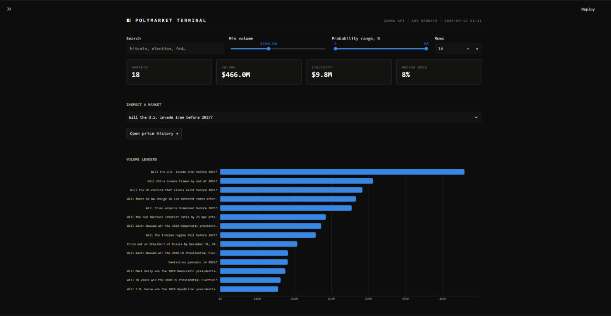
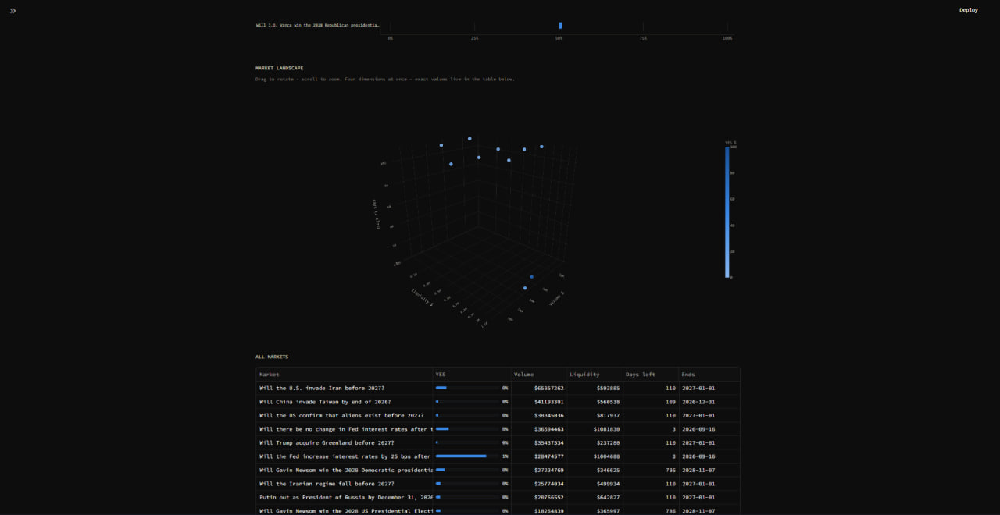
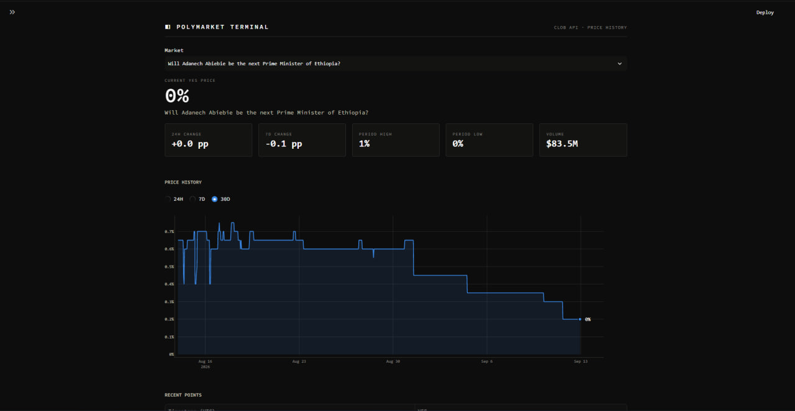

# ◧ Polymarket Terminal

A dark, minimal analytics terminal for [Polymarket](https://polymarket.com)
prediction markets. Built with Python, Streamlit and Plotly on top of
Polymarket's public APIs — no API key required.




## What it does

Prediction markets price the crowd's belief about the future: a contract
trading at $0.73 means the market puts the event at roughly 73%. This terminal
reads those prices live and turns them into something you can actually scan.

- **Overview** — KPI tiles, volume leaders, and a conviction chart showing how
  far each market sits from a 50/50 coin flip.
- **Market landscape** — an interactive 3D explorer plotting volume, liquidity,
  time to resolution and implied probability at once.
- **Market detail** — one month of hourly price history per market, with 24h and
  7d moves, period high/low, and a range selector.
- **Filters** — search, minimum volume and a probability band that strips out
  longshot contracts, applied to every view at once.




## Tech stack

| Layer | Choice |
|---|---|
| Data | Polymarket Gamma API (metadata) + CLOB API (price history) |
| Fetching | `httpx` |
| Processing | `pandas` |
| Charts | `plotly` |
| UI | `streamlit`, multipage |

## Project structure

The code is layered so each module only knows about the one below it.

```
polymarket.py              API client — pure Python, no Streamlit imports
data.py                    Cached data-access layer (5-minute TTL)
theme.py                   Design tokens, CSS and shared chart chrome
app.py                     Overview page
pages/1_Market_detail.py   Price history for a single market
fetch_markets.py           CLI helper: top markets by volume
probe_clob.py              Dev script for inspecting the CLOB response shape
```

Keeping `polymarket.py` free of Streamlit means the same client can back a bot,
a scheduled collector or a test suite without changes.

## Running it locally

```bash
git clone https://github.com/bckfv49/polymarket-dashboard.git
cd polymarket-dashboard

python -m venv .venv
source .venv/bin/activate        # macOS / Linux
.venv\Scripts\Activate.ps1       # Windows PowerShell

pip install -r requirements.txt
streamlit run app.py
```

The dashboard opens at `http://localhost:8501`. Both APIs are public and
read-only, so there is nothing to configure.

## Design notes

The charts follow a few deliberate rules rather than library defaults:

- **One series, one color.** Bar length already encodes volume, so shading bars
  by volume would double-encode it and waste the only free channel.
- **Sequential for magnitude, diverging for polarity.** A single blue ramp where
  more means darker; blue/red around a neutral midpoint where 50% is a
  meaningful zero.
- **3D for exploration only.** Perspective makes precise comparison unreliable,
  so the 3D view is for spotting shape and outliers — every exact value is
  readable from the 2D charts and tables.
- **Nothing is gated behind a hover.** Each chart has a table twin, so values
  stay reachable by keyboard and screen reader.
- **Neutral deltas.** A rising probability is not inherently good or bad, so the
  sign carries direction and color stays out of it.

The palette was checked for colorblind separation — the blue/red pair measures
ΔE 19.2 under protanopia against a threshold of 8.

## Roadmap

- [ ] SQLite collector storing snapshots over time
- [ ] 24h movers ranked by probability change
- [ ] Sparklines in the market table
- [ ] Scheduled collection via GitHub Actions
- [ ] Tests (`pytest`) and linting (`ruff`) in CI
- [ ] Public deployment on Streamlit Community Cloud
- [ ] Cross-venue comparison against Kalshi

## License

MIT — see [LICENSE](LICENSE).